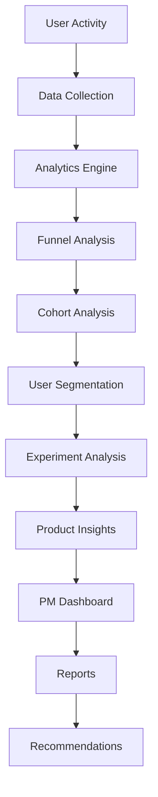

# Trading Intelligence Platform
---
 A Binance-style product analytics platform that helps Product Managers understand, analyze, and optimize the complete **Search → Trade** journey using data-driven insights.

---

## Table of Contents

- [Overview](#overview)
- [Features](#features)
- [Platform Workflow](#platform-workflow)
- [Project Structure](#project-structure)
- [Tech Stack](#tech-stack)
- [Key Metrics](#key-metrics)
- [Getting Started](#getting-started)
- [Usage](#usage)
- [Sample Insight](#sample-insight)
- [Future Enhancements](#future-enhancements)

---

## Overview

Trading Intelligence Platform simulates the internal analytics tooling used by modern cryptocurrency exchanges.

It enables product teams to:

- Analyze user behavior across the full Search → Trade funnel
- Identify conversion bottlenecks and drop-off points
- Evaluate A/B experiments and measure their impact
- Monitor key business metrics in real time
- Surface and prioritize product opportunities automatically

---

## Features

### Search → Trade Funnel Analysis
Tracks the complete user journey across four stages:

```
Search  →  Token Page  →  Order Book  →  Trade
```

Measures conversion rates, stage-level drop-offs, and asset-level performance trends.

---

### User Segmentation
Breaks down behavior across five user types:

| Segment | Description |
|---|---|
| New Users | First-time visitors |
| Returning Users | Previously active accounts |
| Retail Traders | Occasional, low-volume traders |
| Active Traders | Frequent, mid-volume traders |
| High-Value Traders | High-frequency, high-volume accounts |

---

### Cohort Analysis
Tracks user lifecycle patterns over time including weekly and monthly retention, repeat trading activity, and growth trends by acquisition cohort.

---

### Opportunity Scoring Engine
Automatically ranks product opportunities using the formula:

```
Opportunity Score = Search Demand × Conversion Gap × Business Impact
```

Outputs prioritized backlog items across four levels:

```
P0 — Critical    P1 — High    P2 — Medium    P3 — Low
```

---

### A/B Testing Framework
Evaluates product experiments with statistical rigor:

- Conversion lift analysis
- Experiment performance tracking
- User engagement measurement

Example experiments run on the platform:

```
- Search Experience Improvements
- Trending Assets Widget
- Trading CTA Optimization
- Token Information Enhancements
```

---

### Automated PM Reports
Generates weekly product reports covering KPI summaries, funnel performance, growth trends, experiment results, and product recommendations — ready for stakeholder review.

---

### PRD Generator
Produces structured Product Requirement Documents from analytics data:

```
Problem Statement  →  Business Impact  →  Success Metrics
                  →  Proposed Solution  →  Experiment Plan
```

---

## Platform Workflow



---

## Project Structure

```
trading-intelligence-platform/
│
├── app.py                         # Streamlit entry point
│
├── dashboard/
│   ├── kpi_dashboard.py           # Core KPI monitoring
│   ├── funnel_analysis.py         # Search → Trade funnel views
│   ├── cohort_analysis.py         # Retention and lifecycle charts
│   ├── segmentation_dashboard.py  # User segment breakdowns
│   └── experimentation.py         # A/B experiment tracker
│
├── analytics/
│   ├── funnel_engine.py           # Funnel computation logic
│   ├── cohort_engine.py           # Cohort builder
│   ├── segmentation_engine.py     # Segment classifier
│   ├── opportunity_engine.py      # Opportunity scoring
│   ├── recommendation_engine.py   # Recommendation generator
│   └── experimentation_engine.py  # Experiment stats engine
│
├── reports/
│   ├── pm_report_generator.py     # Weekly PM report builder
│   └── prd_generator.py           # PRD auto-generator
│
├── sql/
│   └── analytics_queries.sql      # Core analytics queries
│
├── data/
│   ├── users.csv
│   ├── searches.csv
│   ├── trades.csv
│   └── experiments.csv
│
└── README.md
```

---

## Tech Stack

| Layer | Technology |
|---|---|
| Backend | Python 3.10+ |
| Data Processing | Pandas, NumPy |
| Database | SQL, SQLite |
| Visualization | Streamlit, Plotly |
| Analytics | Custom engines (funnel, cohort, segmentation, A/B) |

---

## Key Metrics

| Metric | Description |
|---|---|
| Search Volume | Total asset searches |
| Trade Volume | Total completed trades |
| Conversion Rate | Search → Trade conversion percentage |
| Retention Rate | Share of returning active users |
| Engagement Score | Depth of user interaction per session |
| Opportunity Score | Composite business impact estimate |
| Experiment Lift | Conversion improvement from A/B tests |

---

## Getting Started

### Prerequisites

```bash
Python 3.10+
pip
```

### Installation

```bash
# Clone the repository
git clone https://github.com/your-username/trading-intelligence-platform.git
cd trading-intelligence-platform

# Install dependencies
pip install -r requirements.txt
```

### Run the Platform

```bash
streamlit run app.py
```

---

## Usage

Once running, the platform exposes the following modules via the sidebar:

- **KPI Dashboard** — Live exchange health metrics
- **Funnel Analysis** — Stage-by-stage drop-off visualization
- **Cohort Analysis** — Retention curves by user cohort
- **Segmentation** — Behavioral breakdown by user type
- **Experimentation** — A/B test results and lift comparison
- **Reports** — Auto-generated weekly PM summaries
- **PRD Generator** — Convert insights into product specs

---

## Sample Insight

```
Asset:            PEPE
Search Volume:    +220% Week-over-Week
Conversion Rate:  -18%  Week-over-Week

Insight:
Users are discovering PEPE at high volume
but abandoning before executing a trade.

Recommendation:
Improve asset information visibility,
add market context, and simplify the
trade entry flow for this token.
```

---

## Future Enhancements

- [ ] Binance API integration for live data
- [ ] CoinGecko market data feed
- [ ] Search intent classification
- [ ] Predictive conversion models (ML)
- [ ] Real-time event streaming pipeline
- [ ] Personalized trading recommendations
- [ ] Automated alerting system
- [ ] Executive product health score

---

## License

This project is licensed under the [MIT License](LICENSE).

---

*Built to simulate the analytics and decision-making workflows used by product teams at leading cryptocurrency exchanges.*
