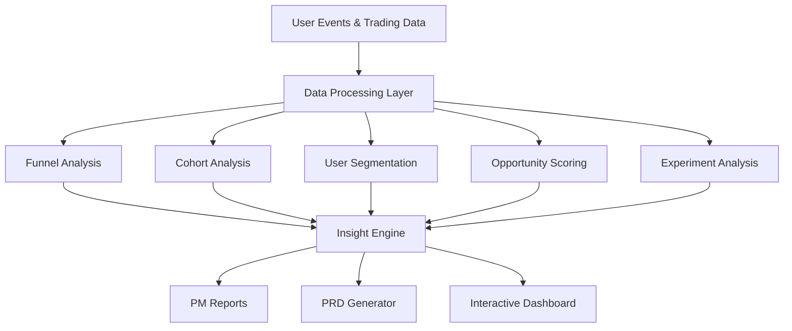

# Trading Intelligence Platform

> A Binance-style product analytics platform that helps Product Managers analyze, optimize, and improve the complete Search → Trade user journey using data-driven insights, experimentation, and growth intelligence.


---

## Overview

Trading Intelligence Platform is a product analytics and growth intelligence system designed to simulate the internal tooling used by modern cryptocurrency exchanges such as Binance.

The platform enables Product Managers to understand how users move through the trading journey, identify conversion bottlenecks, evaluate experiments, prioritize opportunities, and generate actionable recommendations.

Rather than focusing on trade execution itself, this project focuses on the product intelligence layer that drives business decisions.

---

## Problem Statement

Cryptocurrency exchanges process millions of user interactions every day.

Users:

- Search for assets
- Browse token information
- View order books
- Analyze markets
- Execute trades

However, not every search results in a trade.

Product teams need answers to questions like:

- Why are users searching but not trading?
- Which assets have the highest opportunity for growth?
- Where are users dropping off in the funnel?
- Which product experiments improve conversion?
- What should be prioritized next?

This platform helps answer those questions through analytics and product intelligence.

---

## Key Features

### Search → Trade Funnel Analysis

Analyze the complete trading journey:

```text
Search
   ↓
Token Page
   ↓
Order Book
   ↓
Trade
```

Track:

- Funnel conversion rates
- Stage-wise drop-offs
- Asset performance
- User behavior patterns

---

### User Segmentation

Analyze behavior across:

- New Users
- Returning Users
- Retail Traders
- Active Traders
- High-Value Traders

Metrics:

- Conversion Rate
- Engagement
- Trading Activity
- Retention

---

### Cohort Analysis

Track user retention and lifecycle trends.

Measure:

- Weekly Retention
- Monthly Retention
- Repeat Trading Activity
- User Lifetime Value Signals

---

### Opportunity Scoring Engine

Automatically identify high-impact opportunities.

Formula:

```text
Opportunity Score =
Search Demand × Conversion Gap × Business Impact
```

Priority Levels:

- P0 – Critical
- P1 – High
- P2 – Medium
- P3 – Low

Example:

```text
PEPE

Search Volume ↑
Conversion Rate ↓

Result:
High Priority Opportunity
```

---

### A/B Testing Framework

Evaluate product experiments through:

- Conversion Lift Analysis
- Statistical Comparison
- User Engagement Measurement
- Experiment Performance Tracking

Example Experiments:

- Search Page Redesign
- Trending Assets Widget
- New Trading CTA
- Token Information Layout

---

### KPI Dashboard

Monitor exchange performance metrics:

- Daily Active Users (DAU)
- Search Volume
- Trade Volume
- Conversion Rate
- Retention Rate
- Revenue Metrics

---

### Trading Opportunity Discovery

Automatically identify:

- Trending Assets
- Emerging User Interest
- High Search / Low Conversion Assets
- Growth Opportunities

Generate actionable product recommendations.

---

### Automated PM Reports

Generate weekly reports containing:

- KPI Summary
- Funnel Metrics
- Growth Trends
- Experiment Results
- Product Recommendations

---

### Product Recommendation Engine

Transform analytics into actionable decisions.

Example:

```text
Problem:
High search volume but low trade conversion.

Recommendation:
Improve token information visibility
and simplify trade execution flow.
```

---

### PRD Generator

Automatically generate Product Requirement Documents containing:

- Problem Statement
- Business Impact
- Success Metrics
- Proposed Solution
- Experiment Plan

---

## Architecture



---

## Tech Stack

### Backend

- Python
- Pandas
- NumPy

### Database

- SQL
- SQLite

### Visualization

- Streamlit
- Plotly

### Analytics

- Funnel Analysis
- Cohort Analysis
- User Segmentation
- A/B Testing
- KPI Monitoring

---

## Project Structure

```text
trading-intelligence-platform/

├── app.py
│
├── dashboard/
│   ├── kpi_dashboard.py
│   ├── funnel_analysis.py
│   ├── cohort_analysis.py
│   ├── segmentation_dashboard.py
│   └── experimentation.py
│
├── analytics/
│   ├── funnel_engine.py
│   ├── cohort_engine.py
│   ├── segmentation_engine.py
│   ├── opportunity_engine.py
│   ├── recommendation_engine.py
│   └── experimentation_engine.py
│
├── reports/
│   ├── pm_report_generator.py
│   └── prd_generator.py
│
├── sql/
│   └── analytics_queries.sql
│
├── data/
│   ├── users.csv
│   ├── searches.csv
│   ├── trades.csv
│   └── experiments.csv
│
├── assets/
│
└── README.md
```

---

## Key Product Metrics

| Metric | Description |
|----------|------------|
| Search Volume | Total asset searches |
| Trade Volume | Completed trades |
| Conversion Rate | Search → Trade conversion |
| Retention Rate | Returning users |
| Engagement Score | User interaction depth |
| Opportunity Score | Estimated business impact |
| Experiment Lift | Improvement from A/B tests |

---

## Example Product Questions Answered

### Funnel Optimization

- Where are users dropping off?
- Which stage has the highest abandonment?

### Conversion Analysis

- Which assets have the lowest conversion?
- Which assets generate the most trading activity?

### User Behavior

- Which user segments are most valuable?
- Which cohorts retain best over time?

### Product Growth

- Which opportunities should be prioritized?
- Which experiments improve conversion?

---

## Sample Insight

```text
Token: PEPE

Search Volume:
+220% WoW

Conversion Rate:
-18% WoW

Observation:
Users are discovering the asset but not completing trades.

Recommendation:
Improve token information visibility,
market context, and trading entry points.
```

---

## Learning Outcomes

This project demonstrates:

- Product Analytics
- Growth Product Management
- Funnel Optimization
- Experiment Design
- KPI Ownership
- Product Prioritization
- Data-Driven Decision Making
- Exchange Product Strategy
- SQL Analytics
- Dashboard Development

---

## Future Enhancements

- Binance API Integration
- CoinGecko API Integration
- Search Intent Analytics
- Predictive Conversion Models
- ML-Based Opportunity Ranking
- Real-Time Event Streaming
- Personalized Trading Recommendations
- Automated Alerting System
- Executive Product Health Score

---

## Why This Project?

Modern exchanges succeed by understanding user behavior and continuously optimizing the path from discovery to execution.

Trading Intelligence Platform demonstrates how product teams use analytics, experimentation, and user insights to improve engagement, increase trading conversion, and make informed product decisions.

The project combines product management, analytics, SQL, dashboarding, and growth strategy into a single platform that mirrors the type of internal tools used by leading crypto exchanges.

---

### Built for Product Managers, Growth Teams, and Exchange Analytics.
