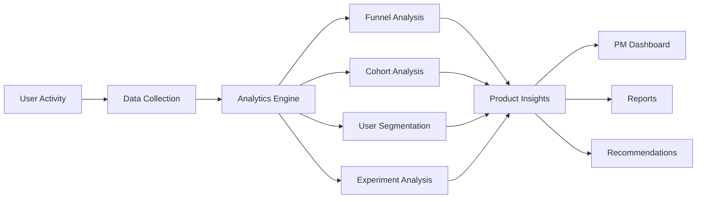

# Trading Intelligence Platform
---
A Binance-style product analytics platform that helps Product Managers understand, analyze, and optimize the complete Search → Trade journey using data-driven insights.

---

## Overview

Trading Intelligence Platform is a product analytics and growth intelligence system designed to simulate the internal tooling used by modern cryptocurrency exchanges.

The platform enables product teams to analyze user behavior, identify conversion bottlenecks, evaluate experiments, monitor key business metrics, and prioritize opportunities that can improve trading activity and user engagement.

By transforming raw user activity into actionable insights, the platform helps answer critical product questions such as:

- Why are users searching but not trading?
- Which assets have the highest growth potential?
- Where are users dropping off in the trading funnel?
- Which experiments improve conversion?
- What opportunities should product teams prioritize?

---

## Features

### Search → Trade Funnel Analysis

Analyze the complete user journey:

```text
Search → Token Page → Order Book → Trade
```

Track:

- Conversion Rates
- Funnel Drop-offs
- Asset Performance
- User Journey Trends

---

### User Segmentation

Analyze behavior across:

- New Users
- Returning Users
- Retail Traders
- Active Traders
- High-Value Traders

Metrics:

- Conversion Rate
- Engagement
- Trading Activity
- Retention

---

### Cohort Analysis

Track user retention and lifecycle trends:

- Weekly Retention
- Monthly Retention
- Repeat Trading Activity
- User Growth Trends

---

### Opportunity Scoring Engine

Automatically identify and rank product opportunities.

Formula:

```text
Opportunity Score =
Search Demand × Conversion Gap × Business Impact
```

Priority Levels:

- P0 — Critical
- P1 — High
- P2 — Medium
- P3 — Low

---

### A/B Testing Framework

Evaluate product experiments through:

- Conversion Lift Analysis
- Experiment Performance Tracking
- Statistical Comparison
- User Engagement Measurement

Example Experiments:

- Search Experience Improvements
- Trending Assets Widget
- Trading CTA Optimization
- Token Information Enhancements

---

### KPI Dashboard

Monitor exchange performance metrics:

- Daily Active Users
- Search Volume
- Trade Volume
- Conversion Rate
- Retention Rate
- Growth Metrics

---

### Trading Opportunity Discovery

Identify:

- Trending Assets
- Emerging User Interest
- High Search / Low Conversion Assets
- Product Growth Opportunities

Generate actionable recommendations for product teams.

---

### Automated PM Reports

Generate weekly product reports containing:

- KPI Summaries
- Funnel Performance
- Growth Trends
- Experiment Results
- Product Recommendations

---

### Product Recommendation Engine

Transform analytics into actionable product decisions.

Example:

```text
Problem:
High search volume but low trade conversion.

Recommendation:
Improve token information visibility
and simplify trading flow.
```

---

### PRD Generator

Automatically generate Product Requirement Documents containing:

- Problem Statement
- Business Impact
- Success Metrics
- Proposed Solution
- Experiment Plan

---

## Platform Workflow



---

## Tech Stack

### Backend

- Python
- Pandas
- NumPy

### Database

- SQL
- SQLite

### Visualization

- Streamlit
- Plotly

### Analytics

- Funnel Analysis
- Cohort Analysis
- User Segmentation
- A/B Testing
- KPI Monitoring

---

## Project Structure

```text
trading-intelligence-platform/

├── app.py
│
├── dashboard/
│   ├── kpi_dashboard.py
│   ├── funnel_analysis.py
│   ├── cohort_analysis.py
│   ├── segmentation_dashboard.py
│   └── experimentation.py
│
├── analytics/
│   ├── funnel_engine.py
│   ├── cohort_engine.py
│   ├── segmentation_engine.py
│   ├── opportunity_engine.py
│   ├── recommendation_engine.py
│   └── experimentation_engine.py
│
├── reports/
│   ├── pm_report_generator.py
│   └── prd_generator.py
│
├── sql/
│   └── analytics_queries.sql
│
├── data/
│   ├── users.csv
│   ├── searches.csv
│   ├── trades.csv
│   └── experiments.csv
│
└── README.md
```

---

## Key Product Metrics

| Metric | Description |
|----------|------------|
| Search Volume | Total asset searches |
| Trade Volume | Total completed trades |
| Conversion Rate | Search → Trade conversion |
| Retention Rate | Returning users |
| Engagement Score | User interaction depth |
| Opportunity Score | Estimated business impact |
| Experiment Lift | Improvement from A/B testing |

---

## Example Product Questions Answered

### Funnel Analysis

- Where are users dropping off?
- Which stage has the highest abandonment rate?

### Conversion Optimization

- Which assets receive high interest but low conversion?
- Which improvements could increase trading activity?

### User Behavior

- Which user segments are most valuable?
- Which cohorts show the strongest retention?

### Experiment Evaluation

- Did a product change improve conversion?
- What was the impact of the experiment?

---

## Sample Insight

```text
Asset: PEPE

Search Volume:
+220% Week-over-Week

Conversion Rate:
-18% Week-over-Week

Insight:
Users are discovering the asset but not completing trades.

Recommendation:
Improve asset information visibility,
market context, and trade entry points.
```

---

## Learning Outcomes

This project demonstrates:

- Product Analytics
- Growth Product Management
- Funnel Optimization
- Experiment Design
- KPI Ownership
- Product Prioritization
- SQL Analytics
- Data-Driven Decision Making
- Exchange Product Strategy
- Dashboard Development

---

## Future Enhancements

- Binance API Integration
- CoinGecko Market Data Integration
- Search Intent Analytics
- Predictive Conversion Models
- Real-Time Event Streaming
- Personalized Trading Recommendations
- Automated Alerting System
- Executive Product Health Score

---

## Why This Project?

Modern cryptocurrency exchanges generate millions of user interactions every day. Understanding how users move from asset discovery to trade execution is critical for improving engagement, conversion, and revenue.

Trading Intelligence Platform demonstrates how product teams leverage analytics, experimentation, and user behavior insights to make informed decisions, prioritize improvements, and drive sustainable product growth.

---

**Built to simulate the analytics and decision-making workflows used by product teams at leading cryptocurrency exchanges.**
